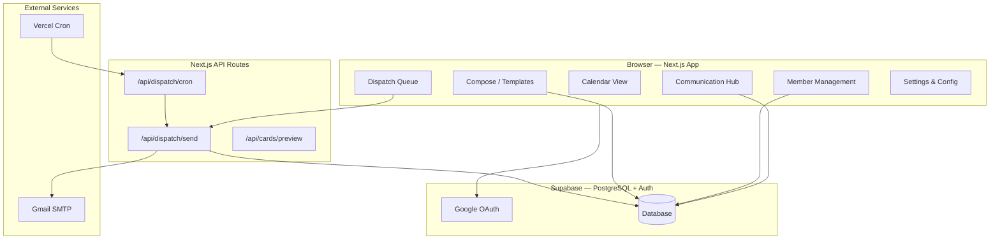
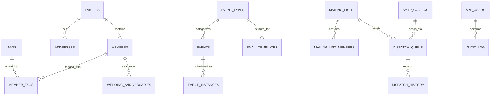
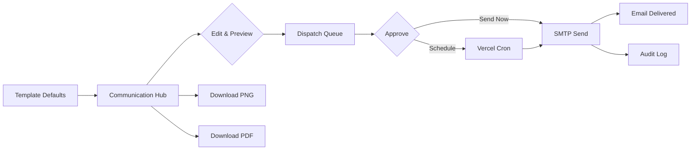

# CCISR Connect

**Church Membership Management & Communication Platform** for Christ Church of India, San Ramon.

A full-featured church management application built with Next.js, Supabase, and Tailwind CSS. Manage members, families, communications, events, and more — all from a single dashboard.

## Features

### Membership Management
- **Member Directory** — Add, edit, deactivate, or permanently delete members
- **Family Grouping** — Organize members into families with family-level activate/deactivate
- **Tags** — Custom color-coded tags (Newcomer, Bible Study, Youth, Volunteer, etc.)
- **City Consolidation** — Smart normalization of city names for filtering
- **Dedup Tool** — Find and resolve duplicate members by name, email, or phone
- **Import/Export** — Import from vCard (.vcf), export filtered lists as styled PDF cards

### Communication Hub
- **Weekly Cards** — Birthday, Anniversary, Bible Study, Women's Study, Bulletin
- **Multi-Location Bible Study** — San Ramon + Mountain House with vacation mode
- **Template System** — Persistent defaults with theme colors, footer verses, resource links
- **Custom Announcements** — Create one-off or reusable custom templates
- **Per-Card Options** — Independent mailing list, SMTP account, and additional recipients per card
- **Future Scheduling** — Navigate weeks ahead to prepare communications in advance
- **Reminders** — Re-send communications with "Reminder:" prefix
- **Download** — PDF and PNG (WhatsApp-ready) exports for every card

### Email Dispatch
- **SMTP Sending** — Send emails via configured Gmail/SMTP accounts
- **Dispatch Queue** — Preview, approve, reschedule, or send now
- **Scheduled Sending** — Vercel cron for automatic daily dispatch
- **Mailing Lists** — To/CC/BCC recipients from members or external emails

### Calendar & Events
- **Week/Month Views** — Colored pill-style events
- **Event Types** — Birthdays (purple), Anniversaries (amber), Events (teal)
- **Event Instances** — Host family, location, status tracking

### Reports & History
- **Demographics** — Clickable stat cards linking to filtered member views
- **City Distribution** — Bar chart with click-through to city-filtered members
- **Activity Log** — Full audit trail with date range, entity filter, and purge
- **Dispatch History** — Search, filter by status/date, preview sent cards

## Architecture



### Data Model



### Communication Flow



## Tech Stack

| Layer | Technology |
|-------|-----------|
| Framework | Next.js 16 (App Router) |
| Language | TypeScript |
| Database | Supabase (PostgreSQL) |
| Auth | Supabase Auth (Google OAuth) |
| UI | Tailwind CSS, shadcn/ui |
| Email | Nodemailer (Gmail SMTP) |
| Fonts | Inter, JetBrains Mono |
| Hosting | Vercel |
| Cron | Vercel Cron Jobs |

## Project Structure

```
ccisr-connect/
├── docs/                        # Documentation
│   ├── SPECIFICATION.md         # Full app specification
│   ├── PROVISIONING.md          # Supabase setup guide
│   └── previews/                # Email card HTML previews
├── scripts/                     # Data migration scripts
├── src/
│   ├── app/
│   │   ├── (auth)/              # Login, unauthorized pages
│   │   ├── (dashboard)/         # All dashboard pages
│   │   │   ├── dashboard/       # Communication Hub
│   │   │   ├── members/         # Member management
│   │   │   ├── calendar/        # Calendar views
│   │   │   ├── compose/         # Email composer + custom templates
│   │   │   ├── dispatch/        # Dispatch queue
│   │   │   ├── history/         # Dispatch & activity history
│   │   │   ├── mailing-lists/   # Recipient management
│   │   │   ├── reports/         # Demographics & stats
│   │   │   └── settings/        # Config, SMTP, tags, templates
│   │   └── api/
│   │       ├── dispatch/        # Send & cron endpoints
│   │       ├── cards/           # Card preview API
│   │       └── auth/            # OAuth callback
│   ├── components/
│   │   ├── dashboard/           # Communication cards, edit forms
│   │   ├── calendar/            # Week & month views
│   │   ├── members/             # Table, cards, family, export, import, dedup
│   │   ├── settings/            # SMTP, users, tags, themes
│   │   ├── layout/              # Sidebar, user nav
│   │   └── ui/                  # shadcn/ui primitives
│   ├── lib/
│   │   ├── email/               # Card builder (HTML email generation)
│   │   ├── supabase/            # Client & middleware
│   │   ├── audit.ts             # Audit logging helper
│   │   ├── city-utils.ts        # City name normalization
│   │   ├── date-utils.ts        # Bulletin week, date helpers
│   │   ├── template-defaults.ts # Template type definitions & fallbacks
│   │   └── utils.ts             # Phone formatting, cn()
│   └── types/
│       └── database.ts          # Full TypeScript types
├── supabase/
│   └── migrations/              # SQL schema & seed data
│       ├── 00001_initial_schema.sql
│       ├── 00002_member_tags.sql
│       └── 00003_migrate_newcomers_to_tags.sql
└── vercel.json                  # Cron job configuration
```

## Getting Started

### Prerequisites
- Node.js 18+
- Supabase project with Google OAuth configured
- Gmail account with App Password for SMTP

### Local Setup

```bash
# Clone
git clone git@github-jerome:jpurusho/ccisr-connect.git
cd ccisr-connect

# Install dependencies
npm install

# Configure environment
cp .env.local.example .env.local
# Edit .env.local with your Supabase and SMTP credentials

# Run database migrations
# Paste contents of each file in supabase/migrations/ into Supabase SQL Editor

# Start dev server
npm run dev
```

### Environment Variables

| Variable | Description | Required |
|----------|------------|----------|
| `NEXT_PUBLIC_SUPABASE_URL` | Supabase project URL | Yes |
| `NEXT_PUBLIC_SUPABASE_ANON_KEY` | Supabase anon/public key | Yes |
| `SUPABASE_SERVICE_ROLE_KEY` | Supabase service role key (server-side) | Yes |
| `CRON_SECRET` | Secret for cron endpoint authentication | Optional |

### Deployment

Connected to Vercel via GitHub integration. Every push to `main` triggers auto-deployment.

**Vercel Settings:**
- Framework: Next.js (auto-detected)
- Root Directory: `./`
- Environment variables set in Vercel project settings
- Cron: Daily at 6 AM UTC for scheduled dispatch sending

## Database Migrations

Run these in order via Supabase SQL Editor:

1. `00001_initial_schema.sql` — Core tables, RLS policies, seed data
2. `00002_member_tags.sql` — Tags system (tags + member_tags tables)
3. `00003_migrate_newcomers_to_tags.sql` — Migrate is_newcomer flags to tags

## License

Private — Christ Church of India, San Ramon
